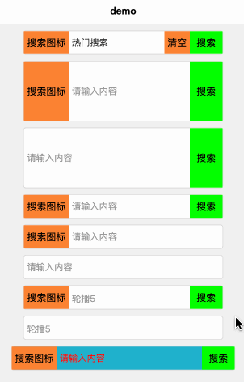

# Uniapp 轮播、跑马灯搜索输入框（DZMUniappCarouselInput）

## 一、简介

* 插件地址：<https://ext.dcloud.net.cn/plugin?id=23295>

* 解决 `uniapp` 跳转页面后，输入框无法获取焦点问题，在手动不刷新页面的情况下 `iOS` 首次跳转焦点还是会获取失败，但是第二次跳转可以，安卓无影响。

* 初始环境 `node：v14.15.0` `npm: v6.14.8`

* 支持：`vue2`、`vue3`，支持 `热门搜索词轮播` 进行搜索

* 推荐下载源码后，直接将组件丢入 `components` 作为 `easycom` 组件使用

* 案例效果

  

## 二、使用

* 案例代码

    ```html
    <template>
        <view class="content">
            <com-search class="search-input" :value="value" focus></com-search>
            <com-search class="search-input" bodyHeight="100" @onChange="onChange" @onSearch="onSearch" @onCarousel="onCarousel" @onClear="onClear" @onFocus="onFocus" @onBlur="onBlur"></com-search>
            <com-search class="search-input" bodyHeight="100" :usePrefixIcon="false"></com-search>
            <com-search class="search-input" :useClearIcon="false"></com-search>
            <com-search class="search-input" :useSearchButton="false"></com-search>
            <com-search class="search-input" :useSearchButton="false" :usePrefixIcon="false" :useClearIcon="false"></com-search>
            <com-search class="search-input" :useInput="false" :carousel="carousel" @onCarousel="onCarousel"></com-search>
            <com-search class="search-input" :useSearchButton="false" :usePrefixIcon="false" :useClearIcon="false" :useInput="false" :carousel="carousel" @onCarousel="onCarousel"></com-search>
            <view class="header-view">
                <com-search
                    :bodyStyle="{
                        'background-color': '#1FB1CC',
                    }"
                    :placeholderStyle="{
                        'color': '#FF0000',
                    }"
                    @onSearch="onSearch"
                ></com-search>
            </view>
        </view>
    </template>

    <script>
    export default {
        data() {
            return {
                value: '热门搜索',
                carousel: []
            }
        },
        mounted() {
            setTimeout(() => {
                this.carousel = ['轮播1', '轮播2', '轮播3', '轮播4', '轮播5', '轮播6', '轮播7']
            }, 1000);
        },
        methods: {
            onChange(value) {
                console.log('输入框值改变', value);
            },
            onSearch(value) {
                console.log('点击搜索', value);
            },
            onCarousel(value) {
                console.log('点击轮播区域', value);
            },
            onClear() {
                console.log('点击清除');
            },
            onFocus(value) {
                console.log('输入框聚焦', value);
            },
            onBlur(value) {
                console.log('输入框失焦', value);
            }
        }
    }
    </script>

    <style scoped>
    .content {
        width: 100vw;
        height: 100vh;
        display: flex;
        flex-direction: column;
        align-items: center;
        background-color: #F0F0F0;
    }
    .search-input {
        /* 加 !important 是因为 com-search 组件内部有宽度样式，内部样式都是内联样式，会被覆盖 */
        width: 80% !important;
        margin-top: 20rpx;
    }
    .header-view {
        width: 100%;
        padding: 20rpx 40rpx 10rpx 40rpx;
        box-sizing: border-box;
    }
    </style>
    ```

## 三、支持属性

* 属性列表

    ```js
    props: {
        // 这里使用 px 单位，是因为滚动内容使用 translateY 进行移动，如果使用 rpx 单位，会导致移动的距离不准确，数值越大，误差越大
        // 主容器默认高度（单位：px），优先使用 bodyStyle 的 height，没有则使用 bodyHeight
        bodyHeight: {
          type: Number | String,
          default: 40,
        },
        // 主容器样式
        bodyStyle: {
          type: Object,
          default: () => ({}),
        },
        // 启用左边前缀图标
        usePrefixIcon: {
          type: Boolean,
          default: true,
        },
        // 左边前缀图标样式
        prefixIconStyle: {
          type: Object,
          default: () => ({}),
        },
        // 启用右边搜索清除图标
        useClearIcon: {
          type: Boolean,
          default: true,
        },
        // 启用右边搜索清除图标聚焦
        useClearIconFocus: {
          type: Boolean,
          default: true,
        },
        // 右边搜索清除图标样式
        clearIconStyle: {
          type: Object,
          default: () => ({}),
        },
        // 启用右边搜索按钮
        useSearchButton: {
          type: Boolean,
          default: true,
        },
        // 右边搜索按钮文本
        searchButtonText: {
          type: String,
          default: '搜索',
        },
        // 右边搜索按钮样式
        searchButtonStyle: {
          type: Object,
          default: () => ({}),
        },
        // 中间搜索框容器样式
        inputContainerStyle: {
          type: Object,
          default: () => ({}),
        },
        // 中间使用输入框，true 使用输入框，false 使用轮播
        useInput: {
          type: Boolean,
          default: true,
        },
        // 输入框值
        value: {
          type: String | undefined,
          default: undefined,
        },
        // 中间输入框最大长度，设置为 -1 的时候不限制最大长度
        maxlength: {
          type: Number,
          default: -1,
        },
        // 中间输入框确认类型
        confirmType: {
          type: String,
          default: 'done',
        },
        // 中间输入框是否聚焦
        focus: {
          type: Boolean,
          default: false,
        },
        // 中间输入框样式
        inputStyle: {
          type: Object,
          default: () => ({}),
        },
        // 中间输入框提示
        placeholder: {
          type: String,
          default: '请输入内容',
        },
        // 中间输入框提示样式
        placeholderStyle: {
          type: Object,
          default: () => ({}),
        },
        // 中间滚动内容
        carousel: {
          type: Array,
          default: () => ([]),
        },
        // 中间滚动内容间隔(单位：ms)
        carouselInterval: {
          type: Number,
          default: 3000,
        },
        // 中间滚动内容动画时间(单位：ms)
        carouselAnimationTime: {
          type: Number,
          default: 300,
        },
        // 中间滚动内容样式
        carouselStyle: {
          type: Object,
          default: () => ({}),
        },
        // 中间滚动内容项样式
        carouselItemStyle: {
          type: Object,
          default: () => ({}),
        },
    },
    ```

* 扩展了解，内部所有的默认样式都是通过 `computed` 完成的，进作为了解即可

    ```js
    computed: {
        bodyStyleComputed () {
          return this.obj2strStyle({
            ...this.bodyStyle,
            'height': this.bodyStyle['height'] || (this.bodyHeight + 'px'),
            'width': this.bodyStyle['width'] || '100%',
            'background-color': this.bodyStyle['background-color'] || '#FFFFFF',
            'border-radius': this.bodyStyle['border-radius'] || '10rpx',
            'border': this.bodyStyle['border'] || '1rpx solid #D8D8D8',
          })
        },
        prefixIconStyleComputed () {
          return this.obj2strStyle({
            ...this.prefixIconStyle,
            'height': this.prefixIconStyle['height'] || '100%',
            'background-color': this.prefixIconStyle['background-color'] || '#FC8333',
            'padding': this.prefixIconStyle['padding'] || '0 10rpx',
          })
        },
        inputContainerStyleComputed () {
          return this.obj2strStyle({
            ...this.inputContainerStyle,
            'padding': this.inputContainerStyle['padding'] || '0 10rpx',
          })
        },
        inputStyleComputed () {
          return this.obj2strStyle({
            ...this.inputStyle,
            'height': this.inputStyle['height'] || '100%',
            'font-size': this.inputStyle['font-size'] || '28rpx',
          })
        },
        placeholderStyleComputed () {
          return this.obj2strStyle({
            ...this.placeholderStyle,
            'font-size': this.placeholderStyle['font-size'] || '28rpx',
          })
        },
        carouselStyleComputed () {
          return this.obj2strStyle({
            ...this.carouselStyle,
            'height': this.carouselStyle['height'] || (this.bodyHeight + 'px'),
            'width': this.carouselStyle['width'] || '100%',
          })
        },
        carouselItemStyleComputed () {
          return this.obj2strStyle({
            ...this.carouselItemStyle,
            'width': this.carouselItemStyle['width'] || '100%',
            'height': this.carouselItemStyle['height'] || '100%',
            'color': this.carouselItemStyle['color'] || '#999999',
            'font-size': this.carouselItemStyle['font-size'] || '28rpx',
            'transform': 'translateY(-' + this.carouselIndex * this.bodyHeight + 'px)',
            'transition': this.carouselIndex === 0 ? 'none' : 'all ' + this.carouselAnimationTime + 'ms',
          })
        },
        clearIconStyleComputed () {
          return this.obj2strStyle({
            ...this.clearIconStyle,
            'height': this.clearIconStyle['height'] || '100%',
            'background-color': this.clearIconStyle['background-color'] || '#FC8333',
            'padding': this.clearIconStyle['padding'] || '0 10rpx',
          })
        },
        searchButtonStyleComputed () {
          return this.obj2strStyle({
            ...this.searchButtonStyle,
            'width': this.searchButtonStyle['width'] || '100rpx',
            'height': this.searchButtonStyle['height'] || '100%',
            'background-color': this.searchButtonStyle['background-color'] || '#00FF00',
          })
        },
    },
    ```